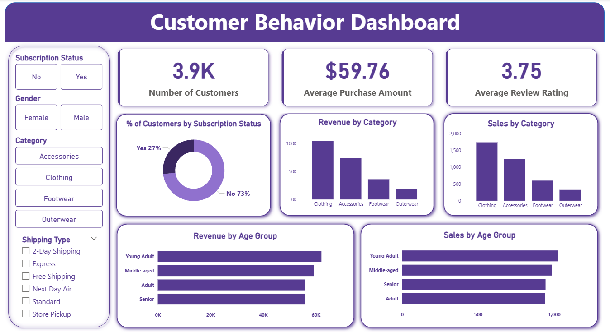

# 🛍️ Customer Shopping Behavior Analysis

_🚀 Understanding consumer purchasing patterns to enhance sales, loyalty, and engagement._

---

## 📘 Proejct Overview

_This project analyzes customer shopping data to uncover behavioral trends, spending habits, and key factors driving purchase decisions. By integrating Python, SQL, and Power BI, it delivers actionable insights to help the retail company improve marketing strategies, optimize product placement, and strengthen customer retention._

A full analytics pipeline was designed using:
- 🐍 **Python** for data cleaning
- 🧮 **SQL** for ETL and exploratory data analysis  
- 📊 **Power BI** for building an interactive dashboard 

---

## 🎯 Business Problem
The company is facing inconsistent sales and changing purchasing patterns across demographics and sales channels. It needs to identify what factors—such as discounts, reviews, seasons, and payment methods—influence buying decisions and repeat purchases to improve sales and customer loyalty.

---

## 📂 Dataset Summary  
- **Rows:** 3,900  
- **Columns:** 18  
- **Key Features:**
    - Customer demographics (Age, Gender, Location, Subscription Status)
    - Purchase details (Item, Category, Purchase Amount, Season, Size, Color)
    - Shopping behavior (Discounts, Promo Codes, Frequency, Ratings, Shipping Type)
- **Missing Data:** values in the Review Rating column 

---

## 🧰 Tools & Technologies  
| Category | Tools Used |
|-----------|-------------|
| **Python** | Data Cleaning, EDA (pandas, numpy) |
| **SQL** | MySQL, Business queries & insights generation |
| **Power BI** | Visualization (KPIs, Interactive Dashboard) |
| **Version Control** | Git & GitHub |

---

## 🏗 Project Structure

```

Customer-Shopping-Behavior-Analysis/
│
├── data/
│   └── customer_shopping_behavior.csv
│
├── images/
│   └── customer_shopping_behavior_dashboard.png
│
├── notebook/
│   └── customer_shopping_behavior_analysis.ipynb
│
├── sql/
│   └── customer_shopping_behavior_analysis.sql
│
├── dashboard/
│   └── customer_shopping_behavior_dashboard.pbix
│
├── README.md
│
└── Customer Shopping Behavior Analysis Report.pdf

```

---

## 🧹 Data Cleaning & Preparation
Performed in Python (pandas & numpy) to ensure quality, consistency, and readiness for analysis:
1. **Data Loading:** Imported the dataset using pandas.read_csv() and verified its structure with df.info() and df.describe().
2. **Missing Data Handling:** Imputed 37 missing values in Review Rating using the median rating per product category.
3. **Column Standardization:** Converted column names to snake_case for uniformity.
4. **Feature Engineering:**
    - Created a new column age_group by binning customer ages into logical ranges (e.g., 18–25, 26–35).
    - Derived purchase_frequency_days from date data to track repeat purchase intervals.
5. **Data Consistency Check:** Found redundancy between discount_applied and promo_code_used, keeping only discount_applied.
6. **Database Integration:** Connected the cleaned DataFrame to PostgreSQL using SQLAlchemy and exported it for SQL-based analysis.

---

## 📊 Exploratory Data Analysis (EDA)
**SQL Analysis Highlights:**
- Revenue by gender and subscription status
- High-spending discount users
- Top 5 products by average rating
- Discount-dependent products
- Customer segmentation: New, Returning, Loyal
- Age group–wise revenue contribution
- Shipping type comparison (Standard vs Express)

---

## 📊 Dashboard

- Power BI Dashboard shows:
    - Revenue and purchase trends
    - Age and gender distribution
    - Customer segmentation and loyalty analysis
    - Product ratings and discount performance



---

## 💡 Business Recommendations
- **Boost Subscriptions:** Promote exclusive offers and early access deals.
- **Loyalty Programs:** Reward repeat buyers with cashback or bonus points.
- **Optimize Discounts:** Identify profitable discount ranges to maintain margins.
- **Product Highlighting:** Showcase top-rated and best-selling products.
- **Targeted Marketing:** Focus campaigns on high-revenue age groups and frequent buyers.

---

## 🚀 Future Work
- Improve outlier detection and handling for cleaner insights.
- Add seasonality and trend analysis to predict demand fluctuations.
- Integrate machine learning models to forecast repeat purchases and churn probability.

---

## 👤 Author & Contact
**Anmol Virdi**  
📧 Email: [anmolvirdi.av@gmail.com](mailto:anmolvirdi.av@gmail.com)  
🔗 LinkedIn: [anmol-virdi-bb4706186](https://www.linkedin.com/in/anmol-virdi-bb4706186/)